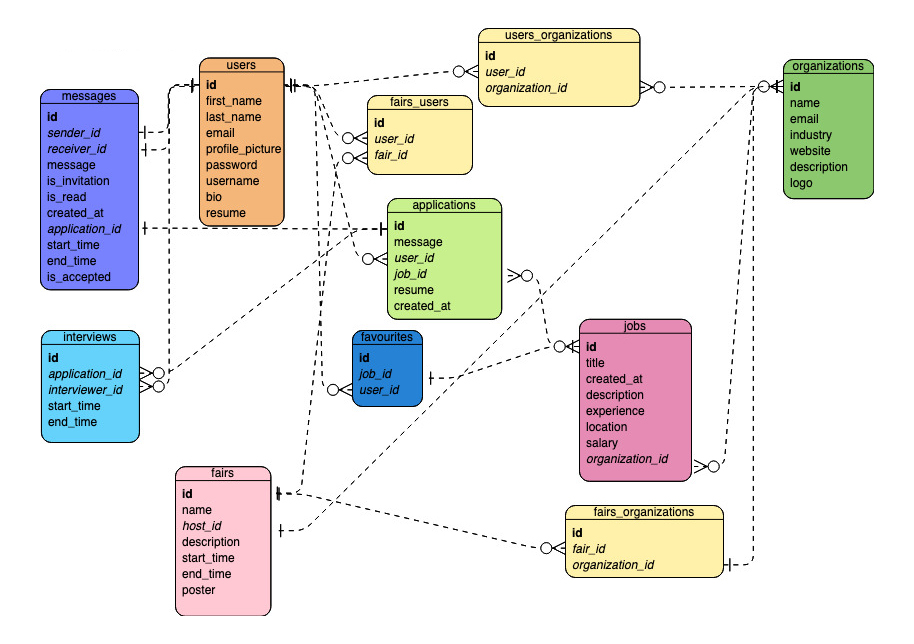

# vCareer

A full-stack application where employers can host interviews and career fairs with real time video and voice engagement. The application also allows employers to post jobs, and job seekers to apply to and bookmark them. Socket.io is used for real time chat and notifications. The live interviews feature a pop-up whiteboard that can be used for real time collaboration. The core of this application was built using React JS. NodeJS, Express, and PostgreSQL database.

This is the final project for the Web Development Bootcamp at [Lighthouse Labs](https://www.lighthouselabs.ca/). The project is done by [@navara99](https://github.com/navara99), [@scc416](https://github.com/scc416) and [@YagneshP](https://github.com/YagneshP).

## Table of Content

- [Live Demo](#live-demo)
- [Final Product](#final-product)
- [Dependencies](#dependencies)
- [Getting Started](#getting-started)
- [Repository Overview](#repository-overview)
- [ERD Diagram](#erd-diagram)
- [Credits](#credits)

## Live Demo

## Final Product

### Home page

- The user can see the current, upcoming and past career fairs

### Live Career Fair

- The user clicks on a live career fair and sees the companies that are hosting stalls in within that particular fair

### Video Conference in Employer's Stall

### Applying to jobs from the Live Fairs Page

- The user can view and apply to a job the employer is promoting from the fairs main page.

### My Organizations Page

- The user can view all organizations they are a part of (companies/schools they belong to).

### Organization Details

- Each organization has a details page, if the current user is a member of that organization, they have access to adding

### Viewing Applications / Booking Interviews

- Members of an organization can view applications posted by that organization. If interested, they could request an interview with the job seeker.

### Automated Interview Requests

- Interview requests are automatically sent to job seeker within the chat feature. Job seeker can discuss a new time or have the option to accept the interview at requested time.

### Calender

- Interview requests and saved career fairs show up in the users personal calender

### Live Interview

- The job seeker and interviewer can enter the live interview through their calender.

### Real Time Whiteboard

- Both the job seeker and the interviewer have access to a collaborative whiteboard.

### User Profiles

- Users have their own profile that they can update. More features are planned for this page.

### Real time chat

- Users have conversations with other users in real time.

### User authentication

- Users can login and logout

### Job Board

- The user has access to a job board, where they can search for, apply, and bookmark jobs.

### Bookmarks

- The user has access to a bookmarks page where they can see the jobs they have bookmarked and jobs they already applied to.

### Upcoming Career Fair

- The user clicks on a upcoming career fair and sees the companies that are hosting stalls in that particular fair. Logged in user can add the fair to the schedule as a job seeker/organization.

### Past Career Fair

- The user clicks on a past career fair and sees the companies that are hosting stalls in that particular fair. Users cannot add the fair to the schedule as it is a past event.

## Dependencies

### Frontend

- [React JS](https://reactjs.org/): Javascript library for building user interfaces
- [date-io](https://github.com/dmtrKovalenko/date-io): Abstraction over common JavaScript date management libraries.
- [emotion-js](https://github.com/emotion-js/emotion): Building on many other CSS-in-JS libraries, it allows you to style apps quickly with string or object styles.
- [Material-UI](https://mui.com/): MUI provides a simple, customizable, and accessible library of React components.
- [Tippy.js](https://atomiks.github.io/tippyjs/): Tippy.js is the complete tooltip, popover, dropdown, and menu solution for the web, powered by Popper.
- [agora-rtc-react](https://github.com/AgoraIO-Community/agora-rtc-react): A react wrapper for [Agora](https://www.agora.io/en/) RTC NG SDK. Used in the application for real time video and audio.
- [axios](https://www.npmjs.com/package/axios): Promise based HTTP client for the browser and node.js.
- [moment](https://www.npmjs.com/package/moment): A JavaScript date library for parsing, validating, manipulating, and formatting dates.
- [React Alice Carousel](https://www.npmjs.com/package/react-alice-carousel): React Alice Carousel is a React component for building content galleries, content rotators and any React carousels. Used in the homepage.
- [React Big Calender](https://www.npmjs.com/package/react-big-calendar): An events calendar component built for React and made for modern browsers.
- [React DOM](https://www.npmjs.com/package/react-dom): This package serves as the entry point to the DOM and server renderers for React.
- [React Draggable](https://www.npmjs.com/package/react-draggable): A simple component for making elements draggable.
- [React Helmet](https://www.npmjs.com/package/react-helmet): This reusable React component will manage all of your changes to the document head.
- [React Router DOM](https://v5.reactrouter.com/web/guides/quick-start): React Router is a lightweight, fully-featured routing library for the React JavaScript library.
- [React Scroll-To-Bottom](https://www.npmjs.com/package/react-scroll-to-bottom): React container that will auto scroll to bottom or top if new content is added and viewport is at the bottom.
- [Socket.IO Client](https://github.com/socketio/socket.io-client): Client library that enables real-time, bidirectional and event-based communication between the browser and the server.

### Backend

- [agora-access-token](https://www.npmjs.com/package/agora-access-token): Build token for video call (stalls in career fair and interviews)
- [bcryptjs](https://github.com/dcodeIO/bcrypt.js): To convert the passwords provided by users
- [chalk](https://github.com/chalk/chalk): Terminal string styling
- [cookie-session](https://github.com/expressjs/cookie-session): Cookie-based session middleware
- [cors](https://github.com/expressjs/cors): A middleware that can be used to enable CORS with various options
- [dotenv](https://github.com/motdotla/dotenv): Loads environment variables from .env
- [express](http://expressjs.com/): Web framework
- [morgan](https://github.com/expressjs/morgan): HTTP request logger middleware
- [multer](https://github.com/expressjs/multer): For uploading files
- [pg](https://github.com/brianc/node-postgres): PostgreSQL client
- [socket.io](https://socket.io/): Realtime application framework, enables real-time bidirectional event-based communication
- [nodemon](https://nodemon.io/): Monitor for any changes in the application and automatically restart the server

## Getting Started

### Server

1. Create the `.env` by using `.env.example` as a reference: `cp .env.example .env`
2. Update the .env file with your correct local information
3. Install dependencies: `npm i`
4. Reset database: `npm run db:reset`

- Check the db folder to see what gets created and seeded in the SDB

7. Run the server: `npm start`

- Note: nodemon is used, so you should not have to restart your server

8. Visit `http://localhost:8080/`

### Client

1. Runs the client in the development mode: `npm start`
2. Open [http://localhost:3000](http://localhost:3000) to view it in the browser.

- The page will reload if you make edits.
- You will also see any lint errors in the console.

## Repository Overview

<pre>
📦v-career
 ┣ 📂client
 ┃ ┣ 📂node_modules
 ┃ ┣ 📂public
 ┃ ┃ ┣ 📜favicon.png
 ┃ ┃ ┣ 📜icon.png
 ┃ ┃ ┗ 📜index.html
 ┃ ┣ 📂src
 ┃ ┃ ┣ 📂Context
 ┃ ┃ ┃ ┗ 📂CurrentUser
 ┃ ┃ ┃ ┃ ┗ 📜CurrentUserContext.jsx
 ┃ ┃ ┣ 📂Providers
 ┃ ┃ ┃ ┗ 📜ThemeProvider.js
 ┃ ┃ ┣ 📂components
 ┃ ┃ ┃ ┣ 📂Bookmarks
 ┃ ┃ ┃ ┃ ┣ 📜Columns.jsx
 ┃ ┃ ┃ ┃ ┗ 📜index.jsx
 ┃ ┃ ┃ ┣ 📂Fair
 ┃ ┃ ┃ ┃ ┣ 📜ExpandedOrganizationListItem.jsx
 ┃ ┃ ┃ ┃ ┣ 📜Fair.css
 ┃ ┃ ┃ ┃ ┣ 📜Header.jsx
 ┃ ┃ ┃ ┃ ┣ 📜HeaderLive.jsx
 ┃ ┃ ┃ ┃ ┣ 📜JobDetailsDialog.jsx
 ┃ ┃ ┃ ┃ ┣ 📜JobList.jsx
 ┃ ┃ ┃ ┃ ┣ 📜JobListItem.jsx
 ┃ ┃ ┃ ┃ ┣ 📜OrganizationList.jsx
 ┃ ┃ ┃ ┃ ┣ 📜OrganizationListItem.jsx
 ┃ ┃ ┃ ┃ ┣ 📜ScheduleButton.jsx
 ┃ ┃ ┃ ┃ ┗ 📜index.jsx
 ┃ ┃ ┃ ┣ 📂Groups
 ┃ ┃ ┃ ┃ ┣ 📜AddMemberForm.jsx
 ┃ ┃ ┃ ┃ ┣ 📜ApplicantsList.jsx
 ┃ ┃ ┃ ┃ ┣ 📜ApplicantsListItem.css
 ┃ ┃ ┃ ┃ ┣ 📜ApplicantsListItem.jsx
 ┃ ┃ ┃ ┃ ┣ 📜ConfirmDelete.jsx
 ┃ ┃ ┃ ┃ ┣ 📜CoverLetter.jsx
 ┃ ┃ ┃ ┃ ┣ 📜EditGroup.jsx
 ┃ ┃ ┃ ┃ ┣ 📜FairListItem.jsx
 ┃ ┃ ┃ ┃ ┣ 📜FairsActions.jsx
 ┃ ┃ ┃ ┃ ┣ 📜FairsForm.jsx
 ┃ ┃ ┃ ┃ ┣ 📜FairsList.jsx
 ┃ ┃ ┃ ┃ ┣ 📜GroupAction.jsx
 ┃ ┃ ┃ ┃ ┣ 📜GroupForm.jsx
 ┃ ┃ ┃ ┃ ┣ 📜GroupListItem.jsx
 ┃ ┃ ┃ ┃ ┣ 📜GroupsBtn.jsx
 ┃ ┃ ┃ ┃ ┣ 📜JobActions.jsx
 ┃ ┃ ┃ ┃ ┣ 📜JobApplicationForm.jsx
 ┃ ┃ ┃ ┃ ┣ 📜JobApplications.jsx
 ┃ ┃ ┃ ┃ ┣ 📜JobForm.jsx
 ┃ ┃ ┃ ┃ ┣ 📜JobListItem.jsx
 ┃ ┃ ┃ ┃ ┣ 📜JobsList.jsx
 ┃ ┃ ┃ ┃ ┣ 📜MemberListItem.jsx
 ┃ ┃ ┃ ┃ ┣ 📜MembersList.jsx
 ┃ ┃ ┃ ┃ ┣ 📜OrganizationDetails.jsx
 ┃ ┃ ┃ ┃ ┣ 📜OrganizationFairs.jsx
 ┃ ┃ ┃ ┃ ┣ 📜OrganizationHeader.jsx
 ┃ ┃ ┃ ┃ ┣ 📜OrganizationJobs.jsx
 ┃ ┃ ┃ ┃ ┣ 📜OrganizationMembers.jsx
 ┃ ┃ ┃ ┃ ┣ 📜Resume.jsx
 ┃ ┃ ┃ ┃ ┣ 📜ScheduleInterviewForm.jsx
 ┃ ┃ ┃ ┃ ┣ 📜groups.css
 ┃ ┃ ┃ ┃ ┗ 📜index.jsx
 ┃ ┃ ┃ ┣ 📂Home
 ┃ ┃ ┃ ┃ ┣ 📜FairList.jsx
 ┃ ┃ ┃ ┃ ┣ 📜FairListItem.jsx
 ┃ ┃ ┃ ┃ ┣ 📜Home.css
 ┃ ┃ ┃ ┃ ┗ 📜index.jsx
 ┃ ┃ ┃ ┣ 📂InterviewRoom
 ┃ ┃ ┃ ┃ ┣ 📜VideoCall.jsx
 ┃ ┃ ┃ ┃ ┣ 📜WhiteBoard.jsx
 ┃ ┃ ┃ ┃ ┣ 📜WhiteBoardModal.jsx
 ┃ ┃ ┃ ┃ ┣ 📜index.jsx
 ┃ ┃ ┃ ┃ ┗ 📜interviewroom.css
 ┃ ┃ ┃ ┣ 📂JobBoard
 ┃ ┃ ┃ ┃ ┣ 📜index.jsx
 ┃ ┃ ┃ ┃ ┗ 📜jobboard.css
 ┃ ┃ ┃ ┣ 📂Messages
 ┃ ┃ ┃ ┃ ┣ 📂Message
 ┃ ┃ ┃ ┃ ┃ ┣ 📜MessageList.jsx
 ┃ ┃ ┃ ┃ ┃ ┗ 📜MessageListItem.jsx
 ┃ ┃ ┃ ┃ ┣ 📂MessageForm
 ┃ ┃ ┃ ┃ ┃ ┗ 📜MessageForm.jsx
 ┃ ┃ ┃ ┃ ┣ 📂Sender
 ┃ ┃ ┃ ┃ ┃ ┣ 📜SenderList.jsx
 ┃ ┃ ┃ ┃ ┃ ┗ 📜SenderListItem.jsx
 ┃ ┃ ┃ ┃ ┣ 📜Messages.css
 ┃ ┃ ┃ ┃ ┗ 📜index.jsx
 ┃ ┃ ┃ ┣ 📂Navbar
 ┃ ┃ ┃ ┃ ┣ 📜Button.jsx
 ┃ ┃ ┃ ┃ ┣ 📜MainButtons.jsx
 ┃ ┃ ┃ ┃ ┣ 📜Navbar.css
 ┃ ┃ ┃ ┃ ┣ 📜NullUserButtons.jsx
 ┃ ┃ ┃ ┃ ┣ 📜UserButtons.jsx
 ┃ ┃ ┃ ┃ ┗ 📜index.jsx
 ┃ ┃ ┃ ┣ 📂ProfileSetting
 ┃ ┃ ┃ ┃ ┣ 📜EditPassword.jsx
 ┃ ┃ ┃ ┃ ┣ 📜EditProfile.jsx
 ┃ ┃ ┃ ┃ ┣ 📜NavColumn.jsx
 ┃ ┃ ┃ ┃ ┗ 📜ProfileSetting.jsx
 ┃ ┃ ┃ ┣ 📂Schedule
 ┃ ┃ ┃ ┃ ┣ 📜Event.jsx
 ┃ ┃ ┃ ┃ ┣ 📜index.jsx
 ┃ ┃ ┃ ┃ ┗ 📜schedule.css
 ┃ ┃ ┃ ┣ 📂Stall
 ┃ ┃ ┃ ┃ ┣ 📜Controls.jsx
 ┃ ┃ ┃ ┃ ┣ 📜Stall.css
 ┃ ┃ ┃ ┃ ┣ 📜Video.jsx
 ┃ ┃ ┃ ┃ ┣ 📜VideoCall.jsx
 ┃ ┃ ┃ ┃ ┗ 📜index.jsx
 ┃ ┃ ┃ ┣ 📂Unauthorized
 ┃ ┃ ┃ ┃ ┣ 📜LoginButton.jsx
 ┃ ┃ ┃ ┃ ┣ 📜LogoutButton.jsx
 ┃ ┃ ┃ ┃ ┗ 📜index.jsx
 ┃ ┃ ┃ ┣ 📂UserProfile
 ┃ ┃ ┃ ┃ ┣ 📜OtherProfile.jsx
 ┃ ┃ ┃ ┃ ┗ 📜UserProfile.jsx
 ┃ ┃ ┃ ┣ 📜ErrorModal.jsx
 ┃ ┃ ┃ ┣ 📜LogIn.jsx
 ┃ ┃ ┃ ┗ 📜Register.jsx
 ┃ ┃ ┣ 📂helpers
 ┃ ┃ ┃ ┣ 📜date.js
 ┃ ┃ ┃ ┣ 📜object.js
 ┃ ┃ ┃ ┗ 📜string.js
 ┃ ┃ ┣ 📂hooks
 ┃ ┃ ┃ ┣ 📜useAllUsers.js
 ┃ ┃ ┃ ┣ 📜useApplications.js
 ┃ ┃ ┃ ┣ 📜useAppliedJobs.js
 ┃ ┃ ┃ ┣ 📜useChannel.js
 ┃ ┃ ┃ ┣ 📜useCurrentUser.js
 ┃ ┃ ┃ ┣ 📜useEachJob.js
 ┃ ┃ ┃ ┣ 📜useExpand.js
 ┃ ┃ ┃ ┣ 📜useFairDetails.js
 ┃ ┃ ┃ ┣ 📜useFairs.js
 ┃ ┃ ┃ ┣ 📜useFavoriteJobs.js
 ┃ ┃ ┃ ┣ 📜useInput.js
 ┃ ┃ ┃ ┣ 📜useInterview.js
 ┃ ┃ ┃ ┣ 📜useJobs.js
 ┃ ┃ ┃ ┣ 📜useMember.js
 ┃ ┃ ┃ ┣ 📜useMessages.js
 ┃ ┃ ┃ ┣ 📜useMyGroups.js
 ┃ ┃ ┃ ┣ 📜useOrganizationDetails.js
 ┃ ┃ ┃ ┣ 📜useOrganizationJobs.js
 ┃ ┃ ┃ ┣ 📜useOtherUserProfile.js
 ┃ ┃ ┃ ┣ 📜useSchedule.js
 ┃ ┃ ┃ ┣ 📜useSpecificJob.js
 ┃ ┃ ┃ ┣ 📜useTitle.js
 ┃ ┃ ┃ ┗ 📜useVideo.js
 ┃ ┃ ┣ 📜App.css
 ┃ ┃ ┣ 📜App.jsx
 ┃ ┃ ┣ 📜constants.js
 ┃ ┃ ┣ 📜index.css
 ┃ ┃ ┗ 📜index.js
 ┃ ┣ 📜README.md
 ┃ ┣ 📜netlify.toml
 ┃ ┣ 📜package-lock.json
 ┃ ┗ 📜package.json
 ┣ 📂docs
 ┣ 📂server
 ┃ ┣ 📂bin
 ┃ ┃ ┗ 📜resetdb.js
 ┃ ┣ 📂db
 ┃ ┃ ┣ 📂queryHelpers
 ┃ ┃ ┃ ┣ 📜interview.js
 ┃ ┃ ┃ ┗ 📜schedule.js
 ┃ ┃ ┣ 📂schema
 ┃ ┃ ┃ ┣ 📜01_users.sql
 ┃ ┃ ┃ ┣ 📜02_organizations.sql
 ┃ ┃ ┃ ┣ 📜03_users_organizations.sql
 ┃ ┃ ┃ ┣ 📜04_fairs.sql
 ┃ ┃ ┃ ┣ 📜05_fairs_organizations.sql
 ┃ ┃ ┃ ┣ 📜06_fairs_users.sql
 ┃ ┃ ┃ ┣ 📜07_jobs.sql
 ┃ ┃ ┃ ┣ 📜08_applications.sql
 ┃ ┃ ┃ ┣ 📜09_messages.sql
 ┃ ┃ ┃ ┣ 📜10_interviews.sql
 ┃ ┃ ┃ ┗ 📜11_favourites.sql
 ┃ ┃ ┣ 📂seeds
 ┃ ┃ ┃ ┣ 📜01_users.sql
 ┃ ┃ ┃ ┣ 📜02_organizations.sql
 ┃ ┃ ┃ ┣ 📜03_users_organizations.sql
 ┃ ┃ ┃ ┣ 📜04_fairs.sql
 ┃ ┃ ┃ ┣ 📜05_fairs_organizations.sql
 ┃ ┃ ┃ ┣ 📜06_fairs_users.sql
 ┃ ┃ ┃ ┣ 📜07_jobs.sql
 ┃ ┃ ┃ ┗ 📜08_messages.sql
 ┃ ┃ ┗ 📜queryHelpers.js
 ┃ ┣ 📂lib
 ┃ ┃ ┣ 📜db.js
 ┃ ┃ ┗ 📜sass-middleware.js
 ┃ ┣ 📂node_modules
 ┃ ┣ 📂public
 ┃ ┃ ┣ 📂uploads
 ┃ ┃ ┃ ┗ 📜.gitkeep
 ┃ ┃ ┗ 📂users_resume
 ┃ ┣ 📂routes
 ┃ ┃ ┣ 📜applications.js
 ┃ ┃ ┣ 📜fairs.js
 ┃ ┃ ┣ 📜interviews.js
 ┃ ┃ ┣ 📜jobs.js
 ┃ ┃ ┣ 📜messages.js
 ┃ ┃ ┣ 📜organizations.js
 ┃ ┃ ┣ 📜schedule.js
 ┃ ┃ ┣ 📜token.js
 ┃ ┃ ┗ 📜users.js
 ┃ ┣ 📜.env
 ┃ ┣ 📜.env.example
 ┃ ┣ 📜README.md
 ┃ ┣ 📜package-lock.json
 ┃ ┣ 📜package.json
 ┃ ┗ 📜server.js
 ┣ 📜.gitignore
 ┣ 📜README.md
 ┗ 📜package-lock.json
</pre>

### 📂client

#### 📂node_modules

#### 📂public

┃ ┃ ┣ 📜favicon.png
┃ ┃ ┣ 📜icon.png
┃ ┃ ┗ 📜index.html

#### 📂src

┃ ┃ ┣ 📂Context
┃ ┃ ┃ ┗ 📂CurrentUser
┃ ┃ ┃ ┃ ┗ 📜CurrentUserContext.jsx
┃ ┃ ┣ 📂Providers
┃ ┃ ┃ ┗ 📜ThemeProvider.js
┃ ┃ ┣ 📂components
┃ ┃ ┃ ┣ 📂Bookmarks
┃ ┃ ┃ ┃ ┣ 📜Columns.jsx
┃ ┃ ┃ ┃ ┗ 📜index.jsx
┃ ┃ ┃ ┣ 📂Fair
┃ ┃ ┃ ┃ ┣ 📜ExpandedOrganizationListItem.jsx
┃ ┃ ┃ ┃ ┣ 📜Fair.css
┃ ┃ ┃ ┃ ┣ 📜Header.jsx
┃ ┃ ┃ ┃ ┣ 📜HeaderLive.jsx
┃ ┃ ┃ ┃ ┣ 📜JobDetailsDialog.jsx
┃ ┃ ┃ ┃ ┣ 📜JobList.jsx
┃ ┃ ┃ ┃ ┣ 📜JobListItem.jsx
┃ ┃ ┃ ┃ ┣ 📜OrganizationList.jsx
┃ ┃ ┃ ┃ ┣ 📜OrganizationListItem.jsx
┃ ┃ ┃ ┃ ┣ 📜ScheduleButton.jsx
┃ ┃ ┃ ┃ ┗ 📜index.jsx
┃ ┃ ┃ ┣ 📂Groups
┃ ┃ ┃ ┃ ┣ 📜AddMemberForm.jsx
┃ ┃ ┃ ┃ ┣ 📜ApplicantsList.jsx
┃ ┃ ┃ ┃ ┣ 📜ApplicantsListItem.css
┃ ┃ ┃ ┃ ┣ 📜ApplicantsListItem.jsx
┃ ┃ ┃ ┃ ┣ 📜ConfirmDelete.jsx
┃ ┃ ┃ ┃ ┣ 📜CoverLetter.jsx
┃ ┃ ┃ ┃ ┣ 📜EditGroup.jsx
┃ ┃ ┃ ┃ ┣ 📜FairListItem.jsx
┃ ┃ ┃ ┃ ┣ 📜FairsActions.jsx
┃ ┃ ┃ ┃ ┣ 📜FairsForm.jsx
┃ ┃ ┃ ┃ ┣ 📜FairsList.jsx
┃ ┃ ┃ ┃ ┣ 📜GroupAction.jsx
┃ ┃ ┃ ┃ ┣ 📜GroupForm.jsx
┃ ┃ ┃ ┃ ┣ 📜GroupListItem.jsx
┃ ┃ ┃ ┃ ┣ 📜GroupsBtn.jsx
┃ ┃ ┃ ┃ ┣ 📜JobActions.jsx
┃ ┃ ┃ ┃ ┣ 📜JobApplicationForm.jsx
┃ ┃ ┃ ┃ ┣ 📜JobApplications.jsx
┃ ┃ ┃ ┃ ┣ 📜JobForm.jsx
┃ ┃ ┃ ┃ ┣ 📜JobListItem.jsx
┃ ┃ ┃ ┃ ┣ 📜JobsList.jsx
┃ ┃ ┃ ┃ ┣ 📜MemberListItem.jsx
┃ ┃ ┃ ┃ ┣ 📜MembersList.jsx
┃ ┃ ┃ ┃ ┣ 📜OrganizationDetails.jsx
┃ ┃ ┃ ┃ ┣ 📜OrganizationFairs.jsx
┃ ┃ ┃ ┃ ┣ 📜OrganizationHeader.jsx
┃ ┃ ┃ ┃ ┣ 📜OrganizationJobs.jsx
┃ ┃ ┃ ┃ ┣ 📜OrganizationMembers.jsx
┃ ┃ ┃ ┃ ┣ 📜Resume.jsx
┃ ┃ ┃ ┃ ┣ 📜ScheduleInterviewForm.jsx
┃ ┃ ┃ ┃ ┣ 📜groups.css
┃ ┃ ┃ ┃ ┗ 📜index.jsx
┃ ┃ ┃ ┣ 📂Home
┃ ┃ ┃ ┃ ┣ 📜FairList.jsx
┃ ┃ ┃ ┃ ┣ 📜FairListItem.jsx
┃ ┃ ┃ ┃ ┣ 📜Home.css
┃ ┃ ┃ ┃ ┗ 📜index.jsx
┃ ┃ ┃ ┣ 📂InterviewRoom
┃ ┃ ┃ ┃ ┣ 📜VideoCall.jsx
┃ ┃ ┃ ┃ ┣ 📜WhiteBoard.jsx
┃ ┃ ┃ ┃ ┣ 📜WhiteBoardModal.jsx
┃ ┃ ┃ ┃ ┣ 📜index.jsx
┃ ┃ ┃ ┃ ┗ 📜interviewroom.css
┃ ┃ ┃ ┣ 📂JobBoard
┃ ┃ ┃ ┃ ┣ 📜index.jsx
┃ ┃ ┃ ┃ ┗ 📜jobboard.css
┃ ┃ ┃ ┣ 📂Messages
┃ ┃ ┃ ┃ ┣ 📂Message
┃ ┃ ┃ ┃ ┃ ┣ 📜MessageList.jsx
┃ ┃ ┃ ┃ ┃ ┗ 📜MessageListItem.jsx
┃ ┃ ┃ ┃ ┣ 📂MessageForm
┃ ┃ ┃ ┃ ┃ ┗ 📜MessageForm.jsx
┃ ┃ ┃ ┃ ┣ 📂Sender
┃ ┃ ┃ ┃ ┃ ┣ 📜SenderList.jsx
┃ ┃ ┃ ┃ ┃ ┗ 📜SenderListItem.jsx
┃ ┃ ┃ ┃ ┣ 📜Messages.css
┃ ┃ ┃ ┃ ┗ 📜index.jsx
┃ ┃ ┃ ┣ 📂Navbar
┃ ┃ ┃ ┃ ┣ 📜Button.jsx
┃ ┃ ┃ ┃ ┣ 📜MainButtons.jsx
┃ ┃ ┃ ┃ ┣ 📜Navbar.css
┃ ┃ ┃ ┃ ┣ 📜NullUserButtons.jsx
┃ ┃ ┃ ┃ ┣ 📜UserButtons.jsx
┃ ┃ ┃ ┃ ┗ 📜index.jsx
┃ ┃ ┃ ┣ 📂ProfileSetting
┃ ┃ ┃ ┃ ┣ 📜EditPassword.jsx
┃ ┃ ┃ ┃ ┣ 📜EditProfile.jsx
┃ ┃ ┃ ┃ ┣ 📜NavColumn.jsx
┃ ┃ ┃ ┃ ┗ 📜ProfileSetting.jsx
┃ ┃ ┃ ┣ 📂Schedule
┃ ┃ ┃ ┃ ┣ 📜Event.jsx
┃ ┃ ┃ ┃ ┣ 📜index.jsx
┃ ┃ ┃ ┃ ┗ 📜schedule.css
┃ ┃ ┃ ┣ 📂Stall
┃ ┃ ┃ ┃ ┣ 📜Controls.jsx
┃ ┃ ┃ ┃ ┣ 📜Stall.css
┃ ┃ ┃ ┃ ┣ 📜Video.jsx
┃ ┃ ┃ ┃ ┣ 📜VideoCall.jsx
┃ ┃ ┃ ┃ ┗ 📜index.jsx
┃ ┃ ┃ ┣ 📂Unauthorized
┃ ┃ ┃ ┃ ┣ 📜LoginButton.jsx
┃ ┃ ┃ ┃ ┣ 📜LogoutButton.jsx
┃ ┃ ┃ ┃ ┗ 📜index.jsx
┃ ┃ ┃ ┣ 📂UserProfile
┃ ┃ ┃ ┃ ┣ 📜OtherProfile.jsx
┃ ┃ ┃ ┃ ┗ 📜UserProfile.jsx
┃ ┃ ┃ ┣ 📜ErrorModal.jsx
┃ ┃ ┃ ┣ 📜LogIn.jsx
┃ ┃ ┃ ┗ 📜Register.jsx
┃ ┃ ┣ 📂helpers
┃ ┃ ┃ ┣ 📜date.js
┃ ┃ ┃ ┣ 📜object.js
┃ ┃ ┃ ┗ 📜string.js
┃ ┃ ┣ 📂hooks
┃ ┃ ┃ ┣ 📜useAllUsers.js
┃ ┃ ┃ ┣ 📜useApplications.js
┃ ┃ ┃ ┣ 📜useAppliedJobs.js
┃ ┃ ┃ ┣ 📜useChannel.js
┃ ┃ ┃ ┣ 📜useCurrentUser.js
┃ ┃ ┃ ┣ 📜useEachJob.js
┃ ┃ ┃ ┣ 📜useExpand.js
┃ ┃ ┃ ┣ 📜useFairDetails.js
┃ ┃ ┃ ┣ 📜useFairs.js
┃ ┃ ┃ ┣ 📜useFavoriteJobs.js
┃ ┃ ┃ ┣ 📜useInput.js
┃ ┃ ┃ ┣ 📜useInterview.js
┃ ┃ ┃ ┣ 📜useJobs.js
┃ ┃ ┃ ┣ 📜useMember.js
┃ ┃ ┃ ┣ 📜useMessages.js
┃ ┃ ┃ ┣ 📜useMyGroups.js
┃ ┃ ┃ ┣ 📜useOrganizationDetails.js
┃ ┃ ┃ ┣ 📜useOrganizationJobs.js
┃ ┃ ┃ ┣ 📜useOtherUserProfile.js
┃ ┃ ┃ ┣ 📜useSchedule.js
┃ ┃ ┃ ┣ 📜useSpecificJob.js
┃ ┃ ┃ ┣ 📜useTitle.js
┃ ┃ ┃ ┗ 📜useVideo.js
┃ ┃ ┣ 📜App.css
┃ ┃ ┣ 📜App.jsx
┃ ┃ ┣ 📜constants.js
┃ ┃ ┣ 📜index.css
┃ ┃ ┗ 📜index.js

#### 📜README.md

#### 📜package-lock.json

#### 📜package.json

### 📂docs

### 📂server

#### 📂bin

┃ ┃ ┗ 📜resetdb.js

#### 📂db

┃ ┃ ┣ 📂queryHelpers
┃ ┃ ┃ ┣ 📜interview.js
┃ ┃ ┃ ┗ 📜schedule.js
┃ ┃ ┣ 📂schema
┃ ┃ ┃ ┣ 📜01_users.sql
┃ ┃ ┃ ┣ 📜02_organizations.sql
┃ ┃ ┃ ┣ 📜03_users_organizations.sql
┃ ┃ ┃ ┣ 📜04_fairs.sql
┃ ┃ ┃ ┣ 📜05_fairs_organizations.sql
┃ ┃ ┃ ┣ 📜06_fairs_users.sql
┃ ┃ ┃ ┣ 📜07_jobs.sql
┃ ┃ ┃ ┣ 📜08_applications.sql
┃ ┃ ┃ ┣ 📜09_messages.sql
┃ ┃ ┃ ┣ 📜10_interviews.sql
┃ ┃ ┃ ┗ 📜11_favourites.sql
┃ ┃ ┣ 📂seeds
┃ ┃ ┃ ┣ 📜01_users.sql
┃ ┃ ┃ ┣ 📜02_organizations.sql
┃ ┃ ┃ ┣ 📜03_users_organizations.sql
┃ ┃ ┃ ┣ 📜04_fairs.sql
┃ ┃ ┃ ┣ 📜05_fairs_organizations.sql
┃ ┃ ┃ ┣ 📜06_fairs_users.sql
┃ ┃ ┃ ┣ 📜07_jobs.sql
┃ ┃ ┃ ┗ 📜08_messages.sql
┃ ┃ ┗ 📜queryHelpers.js

#### 📂lib

┃ ┃ ┣ 📜db.js
┃ ┃ ┗ 📜sass-middleware.js

#### 📂node_modules

#### 📂public

┃ ┃ ┣ 📂uploads
┃ ┃ ┃ ┗ 📜.gitkeep
┃ ┃ ┗ 📂users_resume

#### 📂routes

┃ ┃ ┣ 📜applications.js
┃ ┃ ┣ 📜fairs.js
┃ ┃ ┣ 📜interviews.js
┃ ┃ ┣ 📜jobs.js
┃ ┃ ┣ 📜messages.js
┃ ┃ ┣ 📜organizations.js
┃ ┃ ┣ 📜schedule.js
┃ ┃ ┣ 📜token.js
┃ ┃ ┗ 📜users.js

#### 📜.env.example

#### 📜README.md

#### 📜package-lock.json

#### 📜package.json

#### 📜server.js

### 📜.gitignore

### 📜README.md

### 📜package-lock.json

## ERD Diagram

The database consists of 11 tables:

- users
- organizations
- users_organizations
- fairs
- fairs_organizations
- fairs_users
- jobs
- applications
- messages
- interviews
- favourites

## Credits

- [Favicon](https://www.flaticon.com/free-icons/work) created by [Freepik](https://www.flaticon.com/authors/freepik) - [Flaticon](https://www.flaticon.com/)
