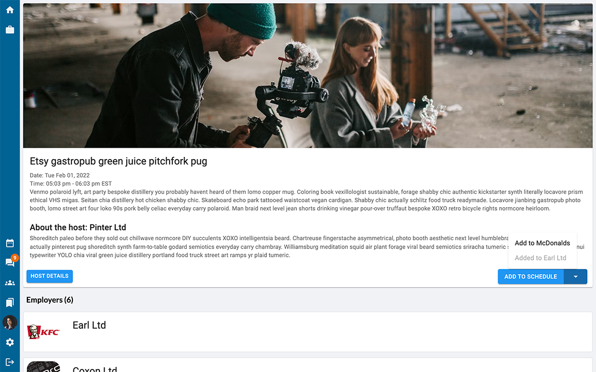
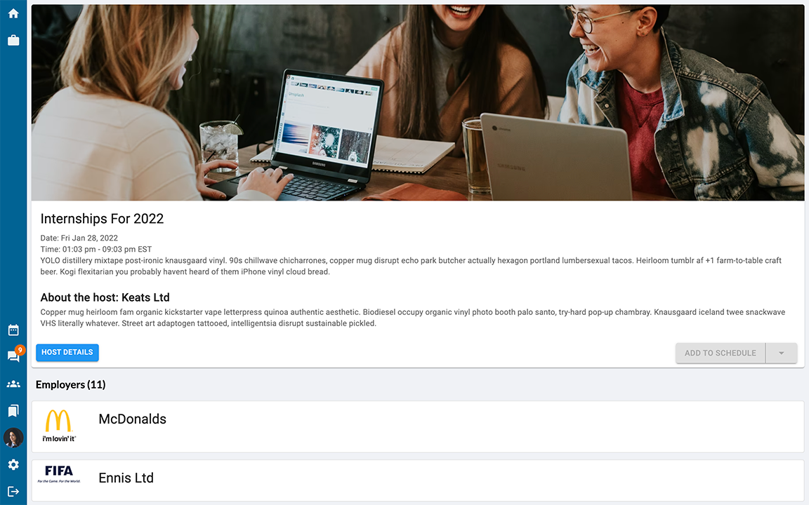

# vCareer

A full-stack application where employers can host interviews and career fairs. vCareer streamlines the hiring process by combing all aspects of it into one application. This application was built using React JS. NodeJS, Express, and PostgreSQL database.

This is the final project for the Web Development Bootcamp at [Lighthouse Labs](https://www.lighthouselabs.ca/). The project is done by [@navara99](https://github.com/navara99), [@scc416](https://github.com/scc416) and [@YagneshP](https://github.com/YagneshP). 

## Table of Content

- [Live Demo](#live-demo)
- [Final Product](#final-product)
- [Dependencies](#dependencies)
- [Getting Started](#getting-started)
- [Repository Overview](#repository-overview)
- [ERD Diagram](#erd-diagram)
- [Credits](#credits)

## Live Demo

## Final Product

### Home page

* The user can see the current, upcoming and past career fairs

### Live Career Fair

* The user clicks on a live career fair and sees the companies that are hosting stalls in within that particular fair

### Video Conference in Employer's Stall

### Applying to jobs from the Live Fairs Page

* The user can view and apply to a job the employer is promoting from the fairs main page.

### My Organizations Page

* The user can view all organizations they are a part of (companies/schools they belong to).

### Job Board

* The user has access to a job board, where they can search for, apply, and bookmark jobs.

## Bookmarks

* The user has access to a bookmarks page where they can see the jobs they have bookmarked and jobs they already applied to.

### Upcoming Career Fair

* The user clicks on a upcoming career fair and sees the companies that are hosting stalls in that particular fair. Logged in user can add the fair to the schedule as a job seeker/organization.

### Past Career Fair

* The user clicks on a past career fair and sees the companies that are hosting stalls in that particular fair. Users cannot add the fair to the schedule as it is a past event.

## Dependencies

### Frontend

### Backend

## Getting Started

## Repository Overview
<pre>
📦v-career
 ┣ 📂client
 ┃ ┣ 📂node_modules
 ┃ ┣ 📂public
 ┃ ┃ ┣ 📜favicon.png
 ┃ ┃ ┣ 📜icon.png
 ┃ ┃ ┗ 📜index.html
 ┃ ┣ 📂src
 ┃ ┃ ┣ 📂Context
 ┃ ┃ ┃ ┗ 📂CurrentUser
 ┃ ┃ ┃ ┃ ┗ 📜CurrentUserContext.jsx
 ┃ ┃ ┣ 📂Providers
 ┃ ┃ ┃ ┗ 📜ThemeProvider.js
 ┃ ┃ ┣ 📂components
 ┃ ┃ ┃ ┣ 📂Bookmarks
 ┃ ┃ ┃ ┃ ┣ 📜Columns.jsx
 ┃ ┃ ┃ ┃ ┗ 📜index.jsx
 ┃ ┃ ┃ ┣ 📂Fair
 ┃ ┃ ┃ ┃ ┣ 📜ExpandedOrganizationListItem.jsx
 ┃ ┃ ┃ ┃ ┣ 📜Fair.css
 ┃ ┃ ┃ ┃ ┣ 📜Header.jsx
 ┃ ┃ ┃ ┃ ┣ 📜HeaderLive.jsx
 ┃ ┃ ┃ ┃ ┣ 📜JobDetailsDialog.jsx
 ┃ ┃ ┃ ┃ ┣ 📜JobList.jsx
 ┃ ┃ ┃ ┃ ┣ 📜JobListItem.jsx
 ┃ ┃ ┃ ┃ ┣ 📜OrganizationList.jsx
 ┃ ┃ ┃ ┃ ┣ 📜OrganizationListItem.jsx
 ┃ ┃ ┃ ┃ ┣ 📜ScheduleButton.jsx
 ┃ ┃ ┃ ┃ ┗ 📜index.jsx
 ┃ ┃ ┃ ┣ 📂Groups
 ┃ ┃ ┃ ┃ ┣ 📜AddMemberForm.jsx
 ┃ ┃ ┃ ┃ ┣ 📜ApplicantsList.jsx
 ┃ ┃ ┃ ┃ ┣ 📜ApplicantsListItem.css
 ┃ ┃ ┃ ┃ ┣ 📜ApplicantsListItem.jsx
 ┃ ┃ ┃ ┃ ┣ 📜ConfirmDelete.jsx
 ┃ ┃ ┃ ┃ ┣ 📜CoverLetter.jsx
 ┃ ┃ ┃ ┃ ┣ 📜EditGroup.jsx
 ┃ ┃ ┃ ┃ ┣ 📜FairListItem.jsx
 ┃ ┃ ┃ ┃ ┣ 📜FairsActions.jsx
 ┃ ┃ ┃ ┃ ┣ 📜FairsForm.jsx
 ┃ ┃ ┃ ┃ ┣ 📜FairsList.jsx
 ┃ ┃ ┃ ┃ ┣ 📜GroupAction.jsx
 ┃ ┃ ┃ ┃ ┣ 📜GroupForm.jsx
 ┃ ┃ ┃ ┃ ┣ 📜GroupListItem.jsx
 ┃ ┃ ┃ ┃ ┣ 📜GroupsBtn.jsx
 ┃ ┃ ┃ ┃ ┣ 📜JobActions.jsx
 ┃ ┃ ┃ ┃ ┣ 📜JobApplicationForm.jsx
 ┃ ┃ ┃ ┃ ┣ 📜JobApplications.jsx
 ┃ ┃ ┃ ┃ ┣ 📜JobForm.jsx
 ┃ ┃ ┃ ┃ ┣ 📜JobListItem.jsx
 ┃ ┃ ┃ ┃ ┣ 📜JobsList.jsx
 ┃ ┃ ┃ ┃ ┣ 📜MemberListItem.jsx
 ┃ ┃ ┃ ┃ ┣ 📜MembersList.jsx
 ┃ ┃ ┃ ┃ ┣ 📜OrganizationDetails.jsx
 ┃ ┃ ┃ ┃ ┣ 📜OrganizationFairs.jsx
 ┃ ┃ ┃ ┃ ┣ 📜OrganizationHeader.jsx
 ┃ ┃ ┃ ┃ ┣ 📜OrganizationJobs.jsx
 ┃ ┃ ┃ ┃ ┣ 📜OrganizationMembers.jsx
 ┃ ┃ ┃ ┃ ┣ 📜Resume.jsx
 ┃ ┃ ┃ ┃ ┣ 📜ScheduleInterviewForm.jsx
 ┃ ┃ ┃ ┃ ┣ 📜groups.css
 ┃ ┃ ┃ ┃ ┗ 📜index.jsx
 ┃ ┃ ┃ ┣ 📂Home
 ┃ ┃ ┃ ┃ ┣ 📜FairList.jsx
 ┃ ┃ ┃ ┃ ┣ 📜FairListItem.jsx
 ┃ ┃ ┃ ┃ ┣ 📜Home.css
 ┃ ┃ ┃ ┃ ┗ 📜index.jsx
 ┃ ┃ ┃ ┣ 📂InterviewRoom
 ┃ ┃ ┃ ┃ ┣ 📜VideoCall.jsx
 ┃ ┃ ┃ ┃ ┣ 📜WhiteBoard.jsx
 ┃ ┃ ┃ ┃ ┣ 📜WhiteBoardModal.jsx
 ┃ ┃ ┃ ┃ ┣ 📜index.jsx
 ┃ ┃ ┃ ┃ ┗ 📜interviewroom.css
 ┃ ┃ ┃ ┣ 📂JobBoard
 ┃ ┃ ┃ ┃ ┣ 📜index.jsx
 ┃ ┃ ┃ ┃ ┗ 📜jobboard.css
 ┃ ┃ ┃ ┣ 📂Messages
 ┃ ┃ ┃ ┃ ┣ 📂Message
 ┃ ┃ ┃ ┃ ┃ ┣ 📜MessageList.jsx
 ┃ ┃ ┃ ┃ ┃ ┗ 📜MessageListItem.jsx
 ┃ ┃ ┃ ┃ ┣ 📂MessageForm
 ┃ ┃ ┃ ┃ ┃ ┗ 📜MessageForm.jsx
 ┃ ┃ ┃ ┃ ┣ 📂Sender
 ┃ ┃ ┃ ┃ ┃ ┣ 📜SenderList.jsx
 ┃ ┃ ┃ ┃ ┃ ┗ 📜SenderListItem.jsx
 ┃ ┃ ┃ ┃ ┣ 📜Messages.css
 ┃ ┃ ┃ ┃ ┗ 📜index.jsx
 ┃ ┃ ┃ ┣ 📂Navbar
 ┃ ┃ ┃ ┃ ┣ 📜Button.jsx
 ┃ ┃ ┃ ┃ ┣ 📜MainButtons.jsx
 ┃ ┃ ┃ ┃ ┣ 📜Navbar.css
 ┃ ┃ ┃ ┃ ┣ 📜NullUserButtons.jsx
 ┃ ┃ ┃ ┃ ┣ 📜UserButtons.jsx
 ┃ ┃ ┃ ┃ ┗ 📜index.jsx
 ┃ ┃ ┃ ┣ 📂ProfileSetting
 ┃ ┃ ┃ ┃ ┣ 📜EditPassword.jsx
 ┃ ┃ ┃ ┃ ┣ 📜EditProfile.jsx
 ┃ ┃ ┃ ┃ ┣ 📜NavColumn.jsx
 ┃ ┃ ┃ ┃ ┗ 📜ProfileSetting.jsx
 ┃ ┃ ┃ ┣ 📂Schedule
 ┃ ┃ ┃ ┃ ┣ 📜Event.jsx
 ┃ ┃ ┃ ┃ ┣ 📜index.jsx
 ┃ ┃ ┃ ┃ ┗ 📜schedule.css
 ┃ ┃ ┃ ┣ 📂Stall
 ┃ ┃ ┃ ┃ ┣ 📜Controls.jsx
 ┃ ┃ ┃ ┃ ┣ 📜Stall.css
 ┃ ┃ ┃ ┃ ┣ 📜Video.jsx
 ┃ ┃ ┃ ┃ ┣ 📜VideoCall.jsx
 ┃ ┃ ┃ ┃ ┗ 📜index.jsx
 ┃ ┃ ┃ ┣ 📂Unauthorized
 ┃ ┃ ┃ ┃ ┣ 📜LoginButton.jsx
 ┃ ┃ ┃ ┃ ┣ 📜LogoutButton.jsx
 ┃ ┃ ┃ ┃ ┗ 📜index.jsx
 ┃ ┃ ┃ ┣ 📂UserProfile
 ┃ ┃ ┃ ┃ ┣ 📜OtherProfile.jsx
 ┃ ┃ ┃ ┃ ┗ 📜UserProfile.jsx
 ┃ ┃ ┃ ┣ 📜ErrorModal.jsx
 ┃ ┃ ┃ ┣ 📜LogIn.jsx
 ┃ ┃ ┃ ┗ 📜Register.jsx
 ┃ ┃ ┣ 📂helpers
 ┃ ┃ ┃ ┣ 📜date.js
 ┃ ┃ ┃ ┣ 📜object.js
 ┃ ┃ ┃ ┗ 📜string.js
 ┃ ┃ ┣ 📂hooks
 ┃ ┃ ┃ ┣ 📜useAllUsers.js
 ┃ ┃ ┃ ┣ 📜useApplications.js
 ┃ ┃ ┃ ┣ 📜useAppliedJobs.js
 ┃ ┃ ┃ ┣ 📜useChannel.js
 ┃ ┃ ┃ ┣ 📜useCurrentUser.js
 ┃ ┃ ┃ ┣ 📜useEachJob.js
 ┃ ┃ ┃ ┣ 📜useExpand.js
 ┃ ┃ ┃ ┣ 📜useFairDetails.js
 ┃ ┃ ┃ ┣ 📜useFairs.js
 ┃ ┃ ┃ ┣ 📜useFavoriteJobs.js
 ┃ ┃ ┃ ┣ 📜useInput.js
 ┃ ┃ ┃ ┣ 📜useInterview.js
 ┃ ┃ ┃ ┣ 📜useJobs.js
 ┃ ┃ ┃ ┣ 📜useMember.js
 ┃ ┃ ┃ ┣ 📜useMessages.js
 ┃ ┃ ┃ ┣ 📜useMyGroups.js
 ┃ ┃ ┃ ┣ 📜useOrganizationDetails.js
 ┃ ┃ ┃ ┣ 📜useOrganizationJobs.js
 ┃ ┃ ┃ ┣ 📜useOtherUserProfile.js
 ┃ ┃ ┃ ┣ 📜useSchedule.js
 ┃ ┃ ┃ ┣ 📜useSpecificJob.js
 ┃ ┃ ┃ ┣ 📜useTitle.js
 ┃ ┃ ┃ ┗ 📜useVideo.js
 ┃ ┃ ┣ 📜App.css
 ┃ ┃ ┣ 📜App.jsx
 ┃ ┃ ┣ 📜constants.js
 ┃ ┃ ┣ 📜index.css
 ┃ ┃ ┗ 📜index.js
 ┃ ┣ 📜README.md
 ┃ ┣ 📜netlify.toml
 ┃ ┣ 📜package-lock.json
 ┃ ┗ 📜package.json
 ┣ 📂docs
 ┣ 📂server
 ┃ ┣ 📂bin
 ┃ ┃ ┗ 📜resetdb.js
 ┃ ┣ 📂db
 ┃ ┃ ┣ 📂queryHelpers
 ┃ ┃ ┃ ┣ 📜interview.js
 ┃ ┃ ┃ ┗ 📜schedule.js
 ┃ ┃ ┣ 📂schema
 ┃ ┃ ┃ ┣ 📜01_users.sql
 ┃ ┃ ┃ ┣ 📜02_organizations.sql
 ┃ ┃ ┃ ┣ 📜03_users_organizations.sql
 ┃ ┃ ┃ ┣ 📜04_fairs.sql
 ┃ ┃ ┃ ┣ 📜05_fairs_organizations.sql
 ┃ ┃ ┃ ┣ 📜06_fairs_users.sql
 ┃ ┃ ┃ ┣ 📜07_jobs.sql
 ┃ ┃ ┃ ┣ 📜08_applications.sql
 ┃ ┃ ┃ ┣ 📜09_messages.sql
 ┃ ┃ ┃ ┣ 📜10_interviews.sql
 ┃ ┃ ┃ ┗ 📜11_favourites.sql
 ┃ ┃ ┣ 📂seeds
 ┃ ┃ ┃ ┣ 📜01_users.sql
 ┃ ┃ ┃ ┣ 📜02_organizations.sql
 ┃ ┃ ┃ ┣ 📜03_users_organizations.sql
 ┃ ┃ ┃ ┣ 📜04_fairs.sql
 ┃ ┃ ┃ ┣ 📜05_fairs_organizations.sql
 ┃ ┃ ┃ ┣ 📜06_fairs_users.sql
 ┃ ┃ ┃ ┣ 📜07_jobs.sql
 ┃ ┃ ┃ ┗ 📜08_messages.sql
 ┃ ┃ ┗ 📜queryHelpers.js
 ┃ ┣ 📂lib
 ┃ ┃ ┣ 📜db.js
 ┃ ┃ ┗ 📜sass-middleware.js
 ┃ ┣ 📂node_modules
 ┃ ┣ 📂public
 ┃ ┃ ┣ 📂uploads
 ┃ ┃ ┃ ┗ 📜.gitkeep
 ┃ ┃ ┗ 📂users_resume
 ┃ ┣ 📂routes
 ┃ ┃ ┣ 📜applications.js
 ┃ ┃ ┣ 📜fairs.js
 ┃ ┃ ┣ 📜interviews.js
 ┃ ┃ ┣ 📜jobs.js
 ┃ ┃ ┣ 📜messages.js
 ┃ ┃ ┣ 📜organizations.js
 ┃ ┃ ┣ 📜schedule.js
 ┃ ┃ ┣ 📜token.js
 ┃ ┃ ┗ 📜users.js
 ┃ ┣ 📜.env
 ┃ ┣ 📜.env.example
 ┃ ┣ 📜README.md
 ┃ ┣ 📜package-lock.json
 ┃ ┣ 📜package.json
 ┃ ┗ 📜server.js
 ┣ 📜.gitignore
 ┣ 📜README.md
 ┗ 📜package-lock.json
</pre>

## ERD Diagram

## Credits

- [Favicon](https://www.flaticon.com/free-icons/work) created by [Freepik](https://www.flaticon.com/authors/freepik) - [Flaticon](https://www.flaticon.com/)
