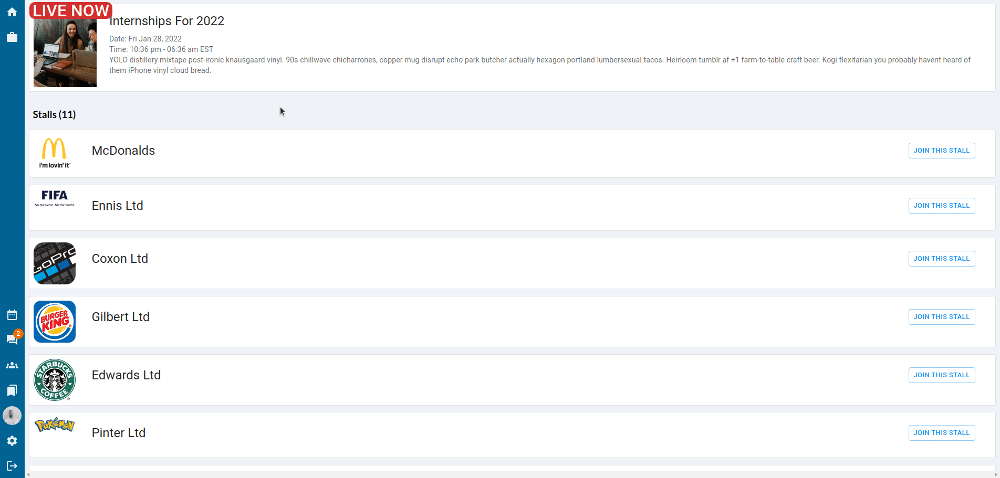
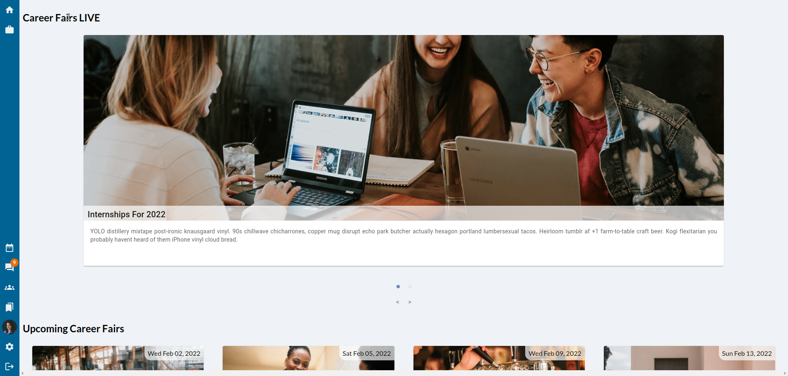
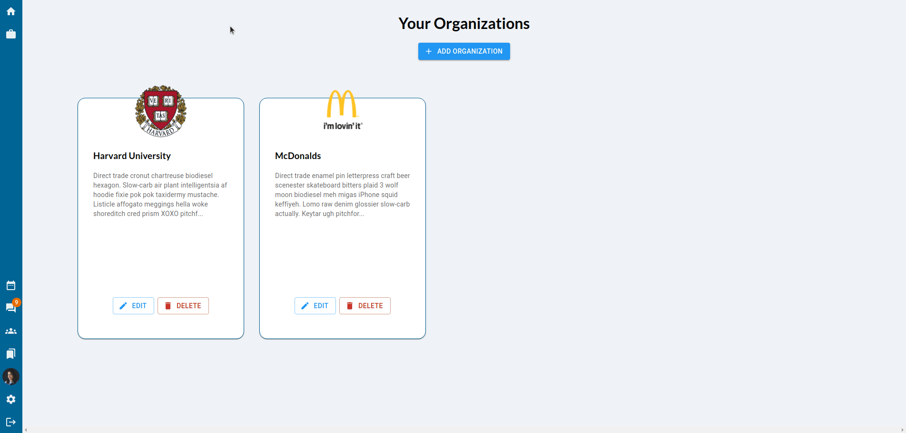
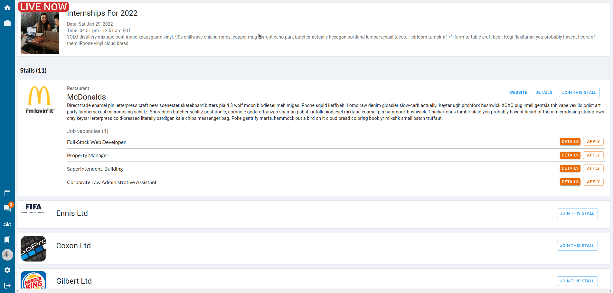
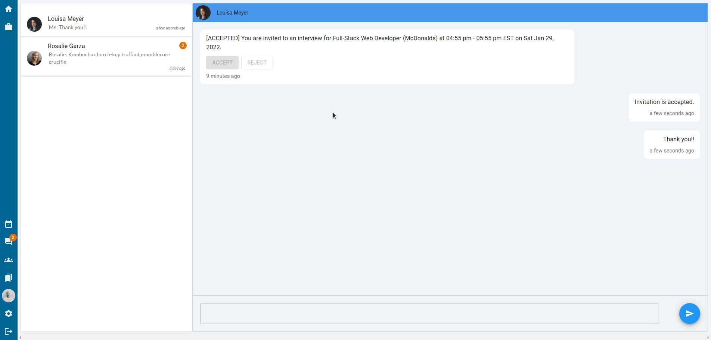
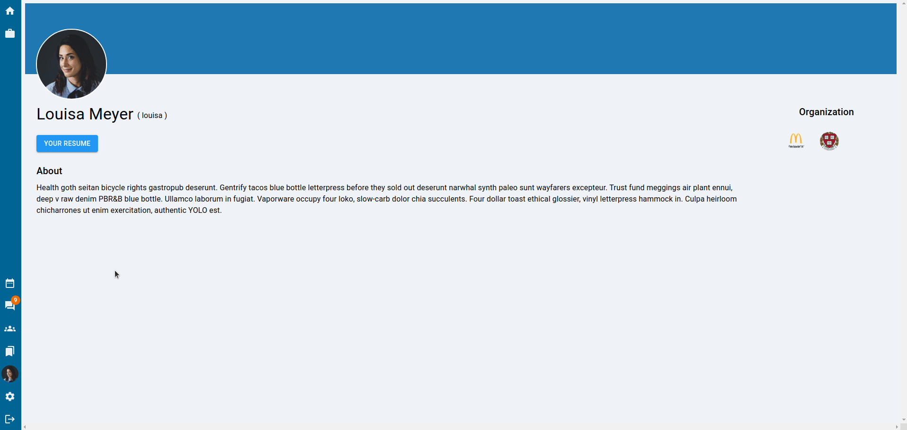
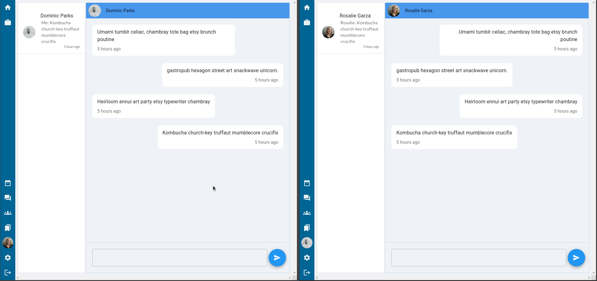
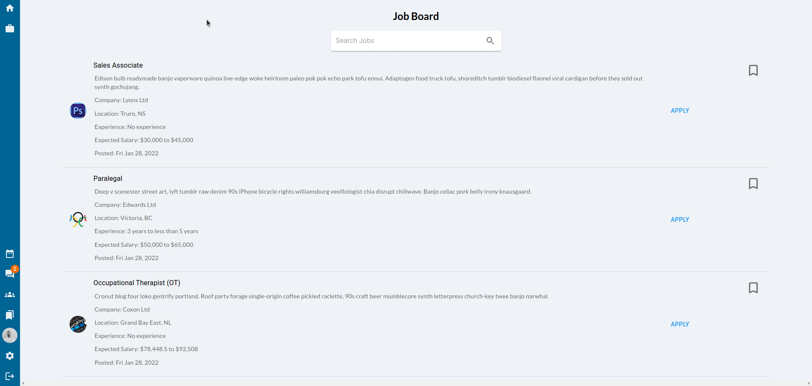
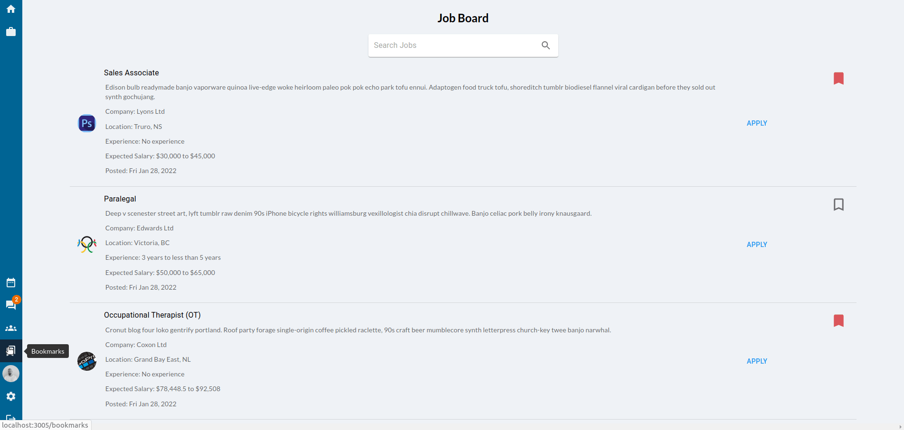

# vCareer

A full-stack application where employers can host interviews and career fairs with real time video and voice engagement. The application also allows employers to post jobs, and job seekers to apply to and bookmark them. Socket.io is used for real time chat and notifications. The live interviews feature a pop-up whiteboard that can be used for real time collaboration. The core of this application was built using React JS. NodeJS, Express, and PostgreSQL database.

This is the final project for the Web Development Bootcamp at [Lighthouse Labs](https://www.lighthouselabs.ca/). The project is done by [@navara99](https://github.com/navara99), [@scc416](https://github.com/scc416) and [@YagneshP](https://github.com/YagneshP). 

## Table of Content

- [Live Demo](#live-demo)
- [Final Product](#final-product)
- [Dependencies](#dependencies)
- [Getting Started](#getting-started)
- [Repository Overview](#repository-overview)
- [ERD Diagram](#erd-diagram)
- [Credits](#credits)

## Live Demo

## Final Product

### Home page

* The user can see the current, upcoming and past career fairs

### Live Career Fair

* The user clicks on a live career fair and sees the companies that are hosting stalls in within that particular fair

### Video Conference in Employer's Stall

### Applying to jobs from the Live Fairs Page

* The user can view and apply to a job the employer is promoting from the fairs main page.

### My Organizations Page

* The user can view all organizations they are a part of (companies/schools they belong to).

### Organization Details

* Each organization has a details page, if the current user is a member of that organization, they have access to adding

### Viewing Applications / Booking Interviews

* Members of an organization can view applications posted by that organization. If interested, they could request an interview with the job seeker.

### Automated Interview Requests

* Interview requests are automatically sent to job seeker within the chat feature. Job seeker can discuss a new time or have the option to accept the interview at requested time. 

### Calender

* Interview requests and saved career fairs show up in the users personal calender 

### Live Interview

* The job seeker and interviewer can enter the live interview through their calender. 

### Real Time Whiteboard

* Both the job seeker and the interviewer have access to a collaborative whiteboard.

### User Profiles

* Users have their own profile that they can update. More features are planned for this page.

### Real time chat

* Users have conversations with other users in real time.

### Job Board

* The user has access to a job board, where they can search for, apply, and bookmark jobs.

## Bookmarks

* The user has access to a bookmarks page where they can see the jobs they have bookmarked and jobs they already applied to.

## Dependencies

### Frontend

### Backend

## Getting Started

## Repository Overview

## ERD Diagram

## Credits

- [Favicon](https://www.flaticon.com/free-icons/work) created by [Freepik](https://www.flaticon.com/authors/freepik) - [Flaticon](https://www.flaticon.com/)
